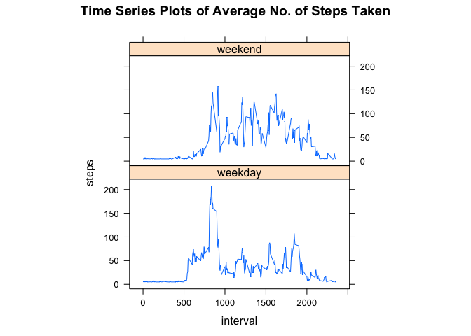

# Reproducible Research: Peer Assessment 1


## Loading and preprocessing the data

1. Load the data (i.e. `read.csv()`)
    
    ```r
    temp <- tempfile()
    download.file(
        "https://d396qusza40orc.cloudfront.net/repdata%2Fdata%2Factivity.zip",
        temp, method="curl")
    file <- unzip(temp)
    unlink(temp)
    dfActivity <- read.csv(file, header=T)
    ```

2. Process/transform the data (if necessary) into a format suitable for your analysis
    
    ```r
    dfActivity$steps <- as.numeric(dfActivity$steps)
    dfActivity$date <- as.Date(dfActivity$date, format="%Y-%m-%d")
    dfActivity$interval <- as.numeric(dfActivity$interval)
    head(dfActivity, n=10L)
    ```
    
    ```
    ##    steps       date interval
    ## 1     NA 2012-10-01        0
    ## 2     NA 2012-10-01        5
    ## 3     NA 2012-10-01       10
    ## 4     NA 2012-10-01       15
    ## 5     NA 2012-10-01       20
    ## 6     NA 2012-10-01       25
    ## 7     NA 2012-10-01       30
    ## 8     NA 2012-10-01       35
    ## 9     NA 2012-10-01       40
    ## 10    NA 2012-10-01       45
    ```

## What is mean total number of steps taken per day?

1. Make a histogram of the total number of steps taken each day
    
    ```r
    dfTotalSteps <- aggregate(steps~date, data=dfActivity, FUN=sum)
    hist(dfTotalSteps$steps, main=paste("Histogram of Total No. of Steps Each Day"),
         xlab = "Total No. of Steps Each Day", ylab = "Frequency")
    ```
    
     
    
2. Calculate and report the **mean** and **median** total number of steps taken per day
    
    ```r
    stepsMean <- mean(dfTotalSteps$steps)
    stepsMedian <- median(dfTotalSteps$steps)
    ```
    
    Mean: **10766.19**
    
    Median: **10765**
    
## What is the average daily activity pattern?

1. Make a time series plot (i.e. `type = "l"`) of the 5-minute interval (x-axis) and the average number of steps taken, averaged across all days (y-axis)
    
    ```r
    dfAvgSteps <- aggregate(steps~interval, data=dfActivity, FUN=mean)
    plot(steps~interval, main="Time Series Plot of Average No. of Steps Taken",
         type="l", data=dfAvgSteps, xlab="Interval (5-minute)", ylab="Average No. of Steps")
    ```
    
     
    
2. Which 5-minute interval, on average across all the days in the dataset, contains the maximum number of steps?
    
    ```r
    intervalWithMax <- dfAvgSteps[which.max(dfAvgSteps$steps), "interval"]
    ```
    
    The 5-minute interval at **835** position contains the maximum
    number of steps.
    
## Imputing missing values

1. Calculate and report the total number of missing values in the dataset (i.e. the total number of rows with `NA`s)
    
    The following is the calculation of the total number of missing values:
    
    ```r
    nrow(dfActivity[which(is.na(dfActivity)),])
    ```
    
    ```
    ## [1] 2304
    ```
    
2. Devise a strategy for filling in all of the missing values in the dataset. The strategy does not need to be sophisticated. For example, you could use the mean/median for that day, or the mean for that 5-minute interval, etc.
    
    Mean for 5-minute interval for each day (i.e. `stepsMean/288` where 288 is the
    number of 5-minute intervals in a day) is used to fill all the missing values 
    in the dataset.
    
3. Create a new dataset that is equal to the original dataset but with the missing data filled in.
    
    ```r
    dfActivityFilled <- dfActivity
    dfActivityFilled[which(is.na(dfActivity)),]$steps <- stepsMean/288
    ```
    
4. Make a histogram of the total number of steps taken each day and Calculate and report the **mean** and **median** total number of steps taken per day. Do these values differ from the estimates from the first part of the assignment? What is the impact of imputing missing data on the estimates of the total daily number of steps?
    
    
    ```r
    dfTotalStepsNew <- aggregate(steps~date, data=dfActivityFilled, FUN=sum)
    hist(dfTotalStepsNew$steps, 
         main=paste("Histogram of Total No. of Steps Each Day (with NA filled)"),
         xlab = "Total No. of Steps Each Day", ylab = "Frequency")
    ```
    
     
    
    
    ```r
    stepsMeanNew <- mean(dfTotalStepsNew$steps)
    stepsMedianNew <- median(dfTotalStepsNew$steps)
    ```
    
    New Mean: **10766.19**
    
    New Median: **10766.19**
    
    With this strategy of filling missing values, the mean remains unchanged but
    the median is changed from **10765** to 
    **10766.19**.
    
    
## Are there differences in activity patterns between weekdays and weekends?

1. Create a new factor variable in the dataset with two levels -- "weekday" and "weekend" indicating whether a given date is a weekday or weekend day.
    
    The R package `timeDate` is installed and loaded for convenience of identifying
    weekdays/weekends. Details of the package can be found at [http://cran.r-project.org/web/packages/timeDate/index.html](http://cran.r-project.org/web/packages/timeDate/index.html).
    
    The following R code creates a factor variable `daytype` that indicates two
    levels - *weekday* and *weekend*.
    
    
    ```r
    library(timeDate)
    ```
    
    ```r
    dfActivityFilled$daytype <- ifelse(isWeekday(dfActivityFilled$date),
                                       "weekday", "weekend")
    head(unique(dfActivityFilled[,c("date","daytype")]), 7)
    ```
    
    ```
    ##            date daytype
    ## 1    2012-10-01 weekday
    ## 289  2012-10-02 weekday
    ## 577  2012-10-03 weekday
    ## 865  2012-10-04 weekday
    ## 1153 2012-10-05 weekday
    ## 1441 2012-10-06 weekend
    ## 1729 2012-10-07 weekend
    ```
    
2. Make a panel plot containing a time series plot (i.e. `type = "l"`) of the 5-minute interval (x-axis) and the average number of steps taken, averaged across all weekday days or weekend days (y-axis).
    
    The following R code uses the `xyplot` in `lattice` package to generate the
    time series plots for weekday days and weekend days.
    
    
    ```r
    library(lattice)
    ```
    
    ```r
    dfAvgStepsFilled <- aggregate(steps~interval+daytype, data=dfActivityFilled, 
                                  FUN=mean)
    xyplot(steps~interval|factor(daytype), 
           main="Time Series Plots of Average No. of Steps Taken",
           type="l", data=dfAvgStepsFilled, aspect=1/2)
    ```
    
     
